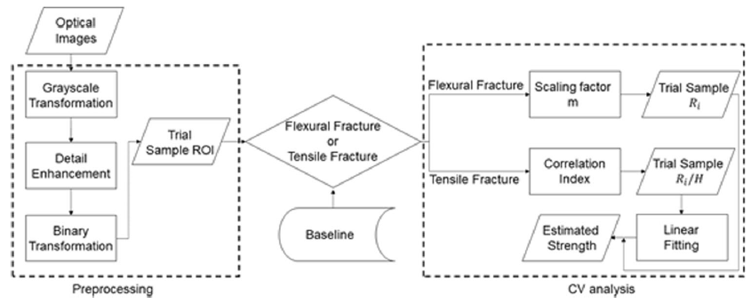

# VisualFracto

The official MATLAB implementation of visual analysis for silicate glass fractography, which 
is from the Journal of Materials Engineering and Performance paper "Automated Quantitative Fractography of Silicate Glasses with Visual Analysis". 
The paper first introduces and tests a visual analysis algorithm to carry out the fractographic analysis of silicate glasses automatically and objectively. 
The fracture surfaces of various silicate glasses produced by both tensile and flexural stress fields were considered. 
First, optical images of the fracture surfaces were gathered and unique; 
descriptive features such as the shape of the ‘mirror-mist boundary’ were extracted using visual analysis tools. 
Next, a newly developed algorithm compared the processed images with a database comprised of fracture samples of 
known strengths, fracture toughness, stress fields, and geometric features. 
Lastly, dimensional analysis principles coupled with a broad, experimental set of over 2100 fracture surfaces was used to 
accurately estimate the strengths of the imaged fracture surfaces.

## FlowChart

  

## Preparation

1. Environment
   - [MATLAB R2020a](https://www.mathworks.com/products/new_products/release2020a.html)
   - MATLAB GUIDE v2.5(Noted that GUIDE will be removed in the future. See also [Release Notes](https://www.mathworks.com/help/doc-archives.html))
2. Datasets
   - The detailed instruction is in [Automated Quantitative Fractography of Silicate Glasses with Visual Analysis](https://link.springer.com/article/10.1007/s11665-021-05697-1)

## Results

Refer to [Automated Quantitative Fractography of Silicate Glasses with Visual Analysis](https://link.springer.com/article/10.1007/s11665-021-05697-1)
